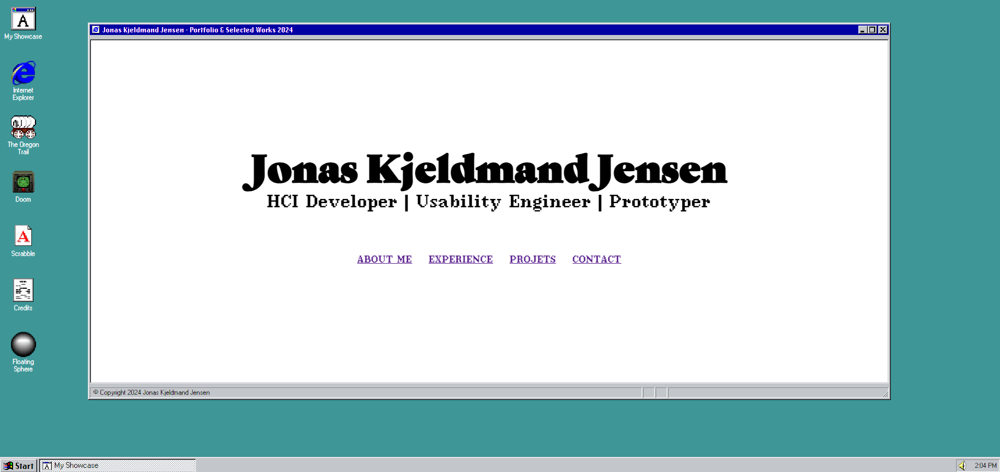

# Jonas Kjeldmand Jensen — Selected Works

<p align="center">
  
</p>

This is my personal website — and I built it as a full Windows 95/98 desktop rather than a
scrolling page, because I'd rather you *explore* who I am than skim me. Open a few icons,
snoop through the folders, read the guestbook. That's the point.

I'm a PhD researcher at Copenhagen Business School studying how AI is reshaping managerial
work and well-being, with a background in Human-Computer Interaction (HCI) from the University
of Copenhagen. Outside of research I write software, tinker with physical computing, paint, DJ,
and make music — and this site is where all of that actually lives, not just the résumé version
of it.

**Start here:**

- **About Me** — the real story: how I went from an HCI degree to a PhD on AI and management, and what drives me outside of it
- **Experience** — peer-reviewed papers (ACM CHI, GROUP, CUI) and practitioner writing, translating research into things people can use
- **Projects → Software / Art / Music** — physical computing builds, paintings, DJ sets and production, and the code behind all of it
- **Guestbook** — sign it. I read every entry.

If you're curious about a possible collaboration — research, physical computing, creative/
aesthetic programming, or anything in between — or just want to say hi, reach out through the
**Contact** page or [LinkedIn](https://www.linkedin.com/in/jonas-kjeldmand/). I'd love to hear
from you.

## Poke around the desktop

Every icon does something. A few favourites, in no particular order:

- **Step Outside** — the desktop recedes into a 3D room with a real CRT monitor, built with three.js
- **My Computer** — a small real filesystem: save a file in Notepad and it's still there next time
- **Games** — Doom, Snake, Tetris, Minesweeper, Scrabble, Oregon Trail, and Jonordle (my Wordle clone)
- **Winamp, Paint, Sound Recorder, Pinball, Solitaire** — the classics, vendored from [98.js](https://98.js.org)
- **GitHub Viewer** — browses this repo's commits and files as a Windows 95 file list
- **Weather Station / Market Watch** — small live widgets, because why not
- **Credits** — full attribution for everything borrowed or adapted

For how it's all actually wired together — routing, the guestbook and analytics backend, the
fake filesystem, the 3D scene — open **My Computer → Hard Disk (D:) → Utility → How It's Built**
on the site itself. That's the technical write-up; this README stays about the "what" and "why."

## Running it locally

Fork it, adapt it, make it yours — just give me (and Henry Heffernan, whose original build this
grew out of) a shout if you do.

```bash
# Clone the repository
git clone https://github.com/QC20/selected-works-website.git

# Install dependencies
npm i

# Run the local dev server
npm run dev
```

To serve a production build instead:

```bash
npm i
npm run build
npm start
```

## Built with

React + TypeScript, three.js for the 3D room, Supabase for the guestbook and analytics, and
Vercel for hosting. Games and classic Windows programs are vendored from [98.js](https://98.js.org)
by Isaiah Odhner and run in-browser via [js-dos](https://js-dos.com).

## Credits

- **Henry Heffernan** — the original room, 3D models, and desktop concept this site grew from (MIT License)
- **Isaiah Odhner** — [98.js](https://98.js.org), the Windows 98 programs (Paint, Winamp, Pinball, and more)
- Full list in the **Credits** app on the site itself
